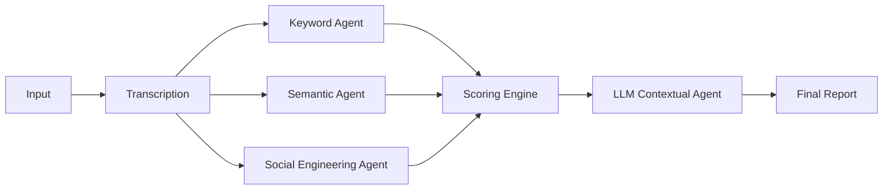

# 🛡️ FraudSentinel AI — 6-Layer Agentic Scam Detector

**FraudSentinel** is a state-of-the-art, multi-agent AI system designed to detect and dissect psychological manipulation in real-time. Whether it's a suspicious bank call or an unexpected prize notification, FraudSentinel analyzes your conversation text or audio to uncover deceptive tactics.

🚀 **Live Demo on Hugging Face:** [coolss21/fraudsentinel_v2](https://huggingface.co/spaces/coolss21/fraudsentinel_v2)

---

## 🏗️ 6-Layer Detection Architecture

FraudSentinel doesn't just look for words; it understands intent. Our pipeline combines traditional analysis with agentic AI reasoning:

1.  **Rule-Based Analysis**: 150+ weighted keywords categorized into 10 high-risk domains.
2.  **Semantic Similarity**: Intent matching using `sentence-transformers` to detect "scam-like" speech patterns.
3.  **Social Engineering Detection**: Probes for common manipulation tactics like Authority, Urgency, and Reciprocity.
4.  **Deep LLM Reasoning**: Utilizes OpenAI models (via OpenRouter) for contextual, multi-turn analysis.
5.  **Risk Scorer**: A composite 4-signal weighted index calculating the final "Scam Score."
6.  **Forensic Reporting**: Generates a detailed breakdown of which tactics were detected.



---

## 🛠️ Technical Stack

- **Framework**: Streamlit (Python)
- **Transcription**: Faster-Whisper (Optimized CTranslate2)
- **Embeddings**: Sentence-Transformers (`all-MiniLM-L6-v2`)
- **LLM**: GPT-4o-mini (Integrated via OpenRouter)
- **Optimizations**: Global model caching for sub-1s analysis and lazy library loading.

---

## 🚀 How to Run Locally

### 1. Prerequisites
- Python 3.10+
- FFmpeg (for audio/video transcription)

### 2. Setup
```bash
# Clone the repository
git clone https://github.com/coolss21/Agentic_AI_Scam_Call_Detection
cd Agentic_AI_Scam_Call_Detection

# Install dependencies
pip install -r requirements.txt
```

### 3. Execution
```bash
streamlit run app.py
```

---

## 🔑 Configuration
To enable the **Deep LLM Analysis** layer, enter your `OPENROUTER_API_KEY` in the application sidebar. This is optional; the core 5-layer detection system works entirely offline.

## 🛡️ License
Distributed under the MIT License. See `LICENSE` for more information.
