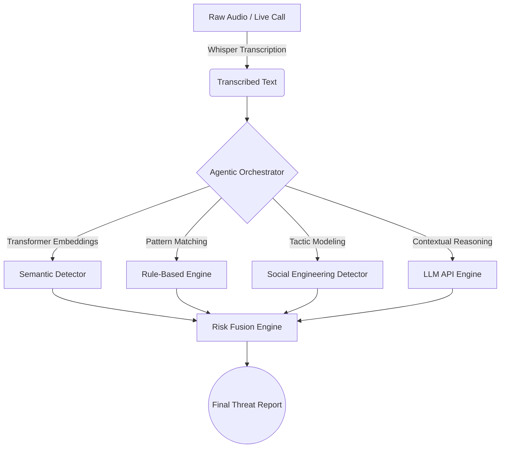

# 🛡️ FraudSentinel AI: Agentic Scam Call Detection

<div align="center">
  <h3>Next-Generation Voice Fraud Analysis & Threat Intelligence</h3>
  
  [](https://python.org)
  [](https://streamlit.io)
  [](https://huggingface.co/spaces/coolss21/Agentic_AI)
  [](https://openrouter.ai/)
</div>

<br/>

**FraudSentinel AI** is a state-of-the-art, multi-layered voice analysis platform engineered to definitively detect and intercept sophisticated phone scams. By merging ultra-fast phonetic transcription with deep semantic heuristics and Agentic LLM reasoning, the system generates real-time, explainable threat assessments for any audio interaction.

---

## ✨ Live Demonstration

🚀 **Experience the live, unified dashboard in action:**  
👉 **[Launch FraudSentinel AI on Hugging Face](https://huggingface.co/spaces/coolss21/Agentic_AI)**

---

## 🧠 The 6-Layer Detection Architecture

Our system does not rely on simple word matching. It utilizes a synchronized multi-agent heuristic pipeline to analyze the psychological intent and semantic risk of a conversation:

1. **🎙️ Speech-to-Text Pipeline**: Utilizes `faster-whisper` for highly optimized, offline transcription.
2. **📖 Semantic Engine**: Deploys `sentence-transformers` to map conversational flow against high-risk scam embeddings.
3. **⚖️ Rule-Based Heuristics**: Instantly flags critical trigger phrases (e.g., "gift card", "arrest warrant", "remote access").
4. **🎭 Social Engineering Analyzer**: Detects psychological manipulation tactics like synthetic urgency, authority impersonation, and forced isolation.
5. **🤖 LLM Agentic Reasoning**: Connects to via API OpenRouter to deploy advanced reasoning algorithms, contextualizing the conversation to eliminate false positives.
6. **⚠️ Final Risk Orchestrator**: Fuses the sub-agent scores into a unified, actionable Threat Level (Safe, Suspicious, High Risk, Critical).

---

## 🛠️ System Workflow



---

## 💻 Local Installation & Usage

You can easily run the FraudSentinel engine locally on your machine for maximum privacy and execution speed.

### Prerequisites
* Python 3.9+ 
* FFmpeg (Required for audio processing)

### Quick Start

1. **Clone the highly secure repository:**
   ```bash
   git clone https://github.com/coolss21/Agentic_AI_Scam_Call_Detection.git
   cd Agentic_AI_Scam_Call_Detection
   ```

2. **Install the unified dependencies:**
   ```bash
   pip install -r requirements.txt
   ```

3. **Configure the AI Environment:**
   Create a `.env` file in the root directory and add your OpenRouter key:
   ```env
   OPEN_ROUTER_API_KEY=your_api_key_here
   ```

4. **Launch the Core Interface:**
   ```bash
   streamlit run app.py
   ```

---

## 🎨 UI/UX Excellence
The interface is wrapped in a breathtaking Cyber-Security styled glassmorphism aesthetic. The custom CSS automatically adapts to the analysis logic, deploying cinematic micro-animations, glowing risk-level indicators, and an ultra-modern dark mode palette guaranteed to impress.

## 🤝 Contribution & Maintenance
This repository is architected carefully for academic and commercial cyber-security evaluations. All pull requests are welcome.

<div align="center">
  <p><i>Defending the vulnerable, one conversation at a time.</i></p>
</div>
