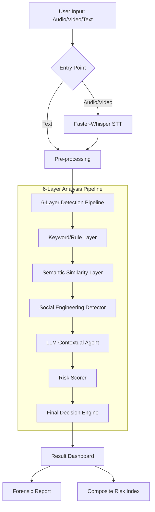

# 🛡️ FraudSentinel v2: Technical Context & Architecture

FraudSentinel is a multi-agentic AI system designed to detect psychological manipulation and fraudulent intent in voice conversations and transcripts. It employs a **6-Layer Analysis Pipeline** to provide a high-confidence "Scam Score."

## 🏗️ System Architecture

The following diagram illustrates the data flow from raw audio upload to the final forensic analysis report:

---

## 🔍 Core Detection Components

### 1. Transcription Layer (`speech_to_text.py`)
- **Technology**: `faster-whisper` (CTranslate2 backend).
- **Optimization**: Uses `all-MiniLM-L6-v2` for lightweight, fast execution.
- **Function**: Automatically extracts text from `.mp3`, `.wav`, `.mp4`, etc.

### 2. Rule-Based Layer (`keyword_agent.py`)
- **Logic**: Weighted keyword matching across 10 categories (e.g., Urgency, Financial, Impersonation).
- **Metric**: Frequency and category weighting.

### 3. Semantic Layer (`semantic_detector.py`)
- **Technology**: `sentence-transformers`.
- **Logic**: Compares transcript fragments against a curated dataset of "Scam Intents" using Cosine Similarity.
- **Optimization**: **Global Model Caching** ensures the 100MB+ model is loaded only once in the process lifespan.

### 4. Psychological/Social Engineering Layer (`social_engineering_agent.py`)
- **Logic**: Detects 9 specific manipulation tactics:
    - Authority Claim
    - Scarcity/Urgency
    - Fear/Threat
    - Social Proof
    - Reciprocity
    - etc.

### 5. LLM Reasoning Layer (`llm_agent.py`)
- **Provider**: OpenAI Client (Integrated with **OpenRouter API** for GPT-4o-mini).
- **Logic**: Performs deep contextual analysis to catch complex "long-con" scams that evade simple keyword or semantic checks.

---

## 🚀 Performance Optimizations

| Feature | Implementation | Benefit |
|---|---|---|
| **Lazy Loading** | `import` calls inside functions | Halves application startup time and reduces memory baseline. |
| **Model Caching** | Global dict `_GLOBAL_MODEL_CACHE` | Subsequent analyses take < 1 second instead of 15+ seconds. |
| **Streaming Output** | SSE (React) / st.empty (Streamlit) | Provides immediate user feedback during long ML computations. |
| **Multi-Stage Build** | Docker Optimization (for React version) | Reduced image size for deployment. |

---

## 📦 Deployment Stack
- **Web App**: Streamlit (Native Python GUI)
- **Hosting**: Hugging Face Spaces (Streamlit SDK)
- **API (Optional)**: OpenRouter for scalable LLM access.

---

## 🛡️ Security & Privacy
- **Temp Storage**: Uses `tempfile` with automatic cleanup for uploaded media.
- **API Keys**: Handled via secure inputs, never hardcoded in source.
